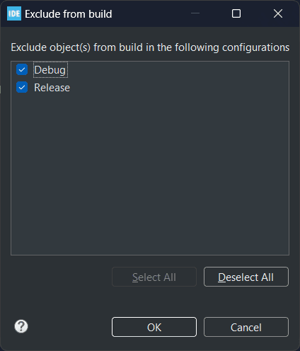

- !! Remember to generate ioc file in STM32CubeIDE **WITH Code Generation** with the following settings:

### Recommended Setup

- Recommended to add the whole library into Drivers/ (drag and drop into Drivers/ in STM32CubeIDE) **by linking**

- Resultant recommended file structure:

- Referring to the screenshot above, remember to exclude the other frameworks **AND all examples** from build

### Notes

- Most of the code in this example was generated by STM32CubeIDE, with the exception of run.cpp

- This example uses SEGGER_RTT with printf redirects, if UART output is desired just remove SEGGER_RTT includes and Init, then redirect printf to UART

- Remember to enable float printf in STM32CubeIDE, right click project -> properties -> C/C++ Build -> Settings -> Tool Settings -> MCU Settings

